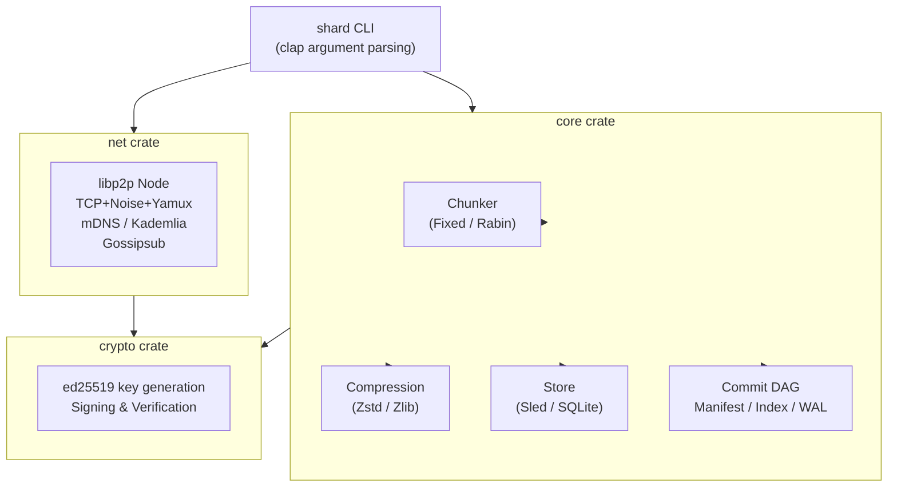
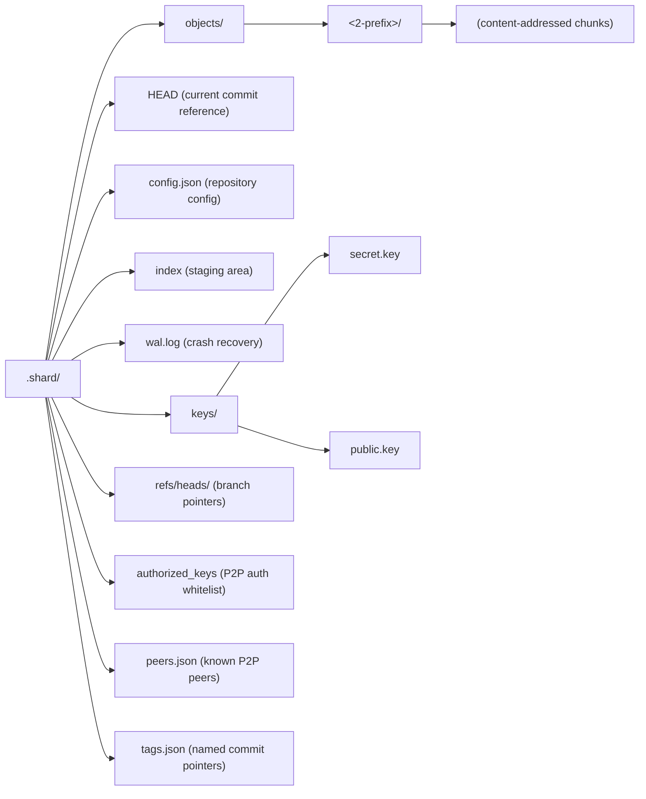

# Architecture

Shard is structured as a collection of decoupled crates, tied together by the main CLI entrypoint. 

## Component Diagram

## Storage Layout

Shard stores all its data in a `.shard/` directory at the root of the repository.

## Key Design Decisions

| Decision | Choice | Rationale |
| :--- | :--- | :--- |
| **Chunking** | Rabin (default) or Fixed | Rabin CDC improves dedup across versions; fixed for predictable sizes |
| **Compression** | Zstd or Zlib | Runtime selection; zstd is faster with better ratios |
| **Hashing** | Blake3 | Fastest cryptographic hash, SIMD-accelerated |
| **Signatures** | ed25519 | Proven, fast, small signatures (64 bytes) |
| **Storage** | Sled or Flat file | Sled embedded (zero deps); flat file for portability |
| **P2P** | libp2p TCP+Noise+Yamux | Mature, NAT traversal via relay/WebRTC planned |
| **Wire format** | JSON | Serde JSON over request-response |
