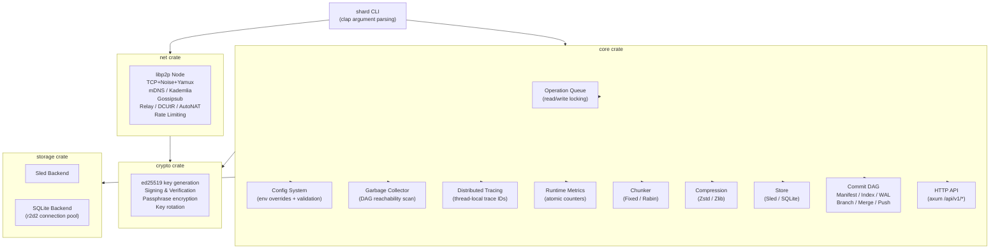
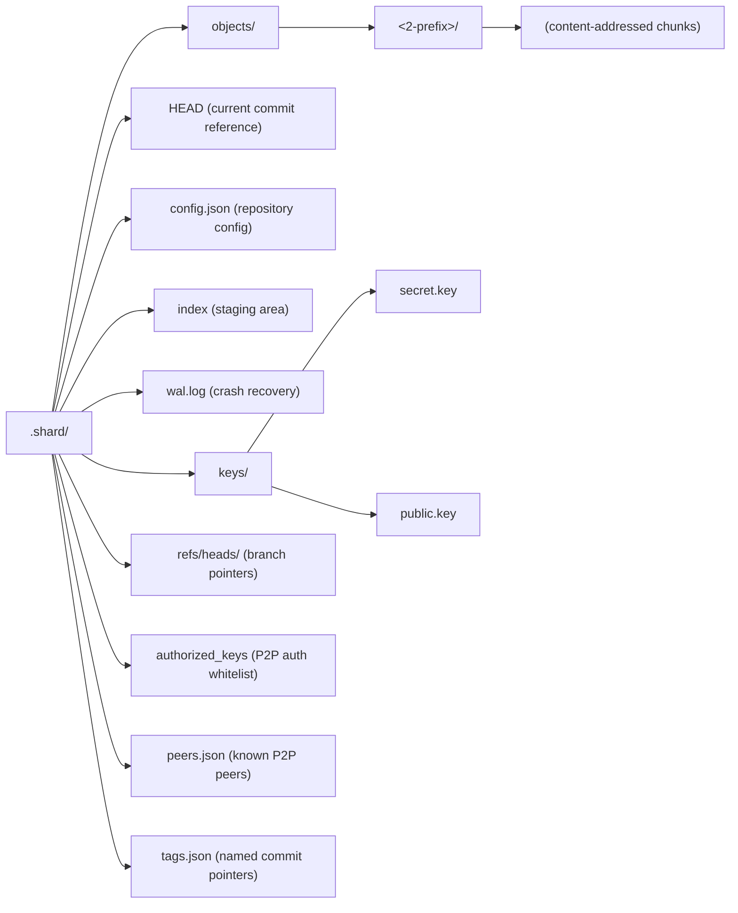

# Architecture

Shard is structured as a collection of decoupled crates, tied together by the main CLI entrypoint. 

## Component Diagram

## Storage Layout

Shard stores all its data in a `.shard/` directory at the root of the repository.

## Key Design Decisions

| Decision | Choice | Rationale |
| :--- | :--- | :--- |
| **Chunking** | Rabin (default) or Fixed | Rabin CDC improves dedup across versions; fixed for predictable sizes |
| **Compression** | Zstd or Zlib | Runtime selection; zstd is faster with better ratios |
| **Hashing** | Blake3 | Fastest cryptographic hash, SIMD-accelerated |
| **Signatures** | ed25519 | Proven, fast, small signatures (64 bytes) |
| **Storage** | Sled, SQLite, or Flat file | Sled/SQLite for indexed queries; flat for portability |
| **P2P** | libp2p TCP+Noise+Yamux | Mature, NAT traversal via relay/DCUtR/AutoNAT |
| **Wire format** | JSON / CBOR | Serde over request-response + Gossipsub |
| **Concurrency** | Per-repo read-write queue | Reads parallel, writes exclusive; no global lock |
| **Config** | JSON + env var overrides | 12-factor friendly; `SHARD_*` env vars take precedence |
| **Tracing** | Thread-local trace IDs | Correlate logs across operations |
| **GC** | DAG reachability scan | Marks all reachable from HEAD/branches/tags/index, prunes rest |
| **Metrics** | Static atomic counters | Runtime operation counters with JSON snapshot |
