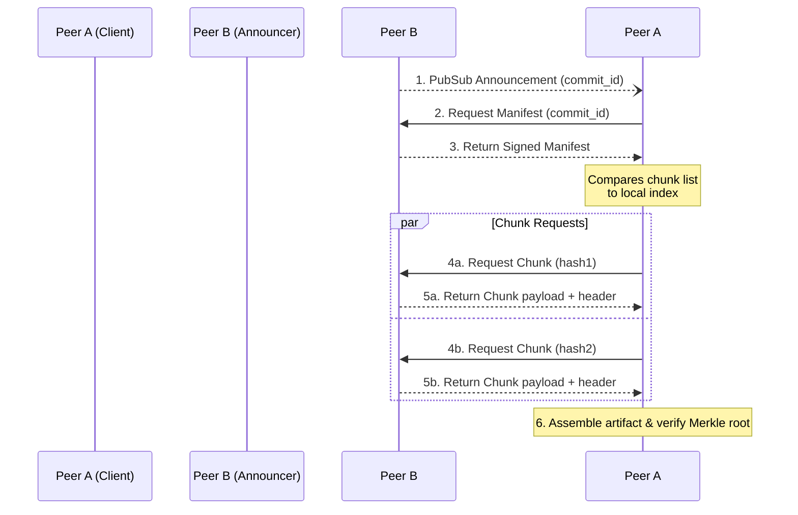

# Protocol Specification

This document details the P2P wire protocol and data synchronization primitives used in Shard.

## Discovery

Nodes in the Shard network must discover each other before exchanging data. We rely on standard `libp2p` protocols:

- **Primary:** libp2p DHT + Kademlia.
- **LAN fallback:** mDNS.
- **Manual bootstrap:** `shard peer add <multiaddr>`.

## Data Model (Deterministic and Canonical)

All metadata in Shard is canonicalized (sorted keys) and signed using `ed25519`.

- **Blob (chunk):** Raw bytes saved in `objects/<2prefix>/<hash>`. Hash is computed using Blake3(chunk).
- **Manifest:** Artifact descriptor containing filename, content type, compression flag, chunk list (ordered), merkle root, size, created_by, and created_at.
- **Commit node:** JSON with `commit_id` (hash of canonical commit JSON), `parents:[]`, `manifests:[]`, `author`, `message`, `timestamp`, `signature`.

## Announcements

When a repository is updated, nodes announce the new commit over the P2P network.

- **Topic:** `shard:ann` (global) and `/shard/repo/<repo_id>` (repo-specific)
- **Payload:** JSON-serialized `Announcement`:

```json
{
  "commit_id": "<blake3 hash>",
  "file_count": 42,
  "total_size": 1073741824,
  "repo_name": "my-model",
  "peer_multiaddr": "/ip4/192.168.1.2/tcp/9876"
}
```

Nodes subscribe to both topics. Announcements are published on initial share, on a 5-second heartbeat, and when new connections are established.

## Rate Limiting

- **Gossipsub:** Custom `message_id_fn` (blake3 content-hash dedup), `max_messages_per_rpc(100)`
- **Announcements:** Per-peer per-commit dedup, max 5 unique (peer,commit_id) pairs per 60s window
- **Requests:** Max 50 per-peer requests per window; request-response timeout of 60s
- **Reset:** All rate counters reset every 5s interval tick
- **Deduplication:** Duplicate messages silently dropped via content-hash message IDs

## Fetch Flow

The core mechanism for retrieving artifacts from peers operates via a parallelized fetch flow.



1. **Announcement:** Peer sees announcement → requests manifest via DHT or direct stream to announcer.
2. **Manifest:** Manifest returned (signed).
3. **Diff:** Peer compares chunk list to local index → requests missing chunks via parallel piece requests (libp2p streams).
4. **Chunks:** Chunks transferred with piece headers `{hash, offset, size}` and signed payload.
5. **Assemble:** On complete, client assembles artifact and verifies Merkle root and final digest.

## Resilience & Security

- **Resilience:** Parallel downloads, chunk retries, resumable transfer (persists partial chunks to `.partial/`).
- **Security:** Metadata signed; payloads integrity verified; optional encryption with per-repo symmetric keys. Key rotation is handled via a signed revocation commit in the DAG.
